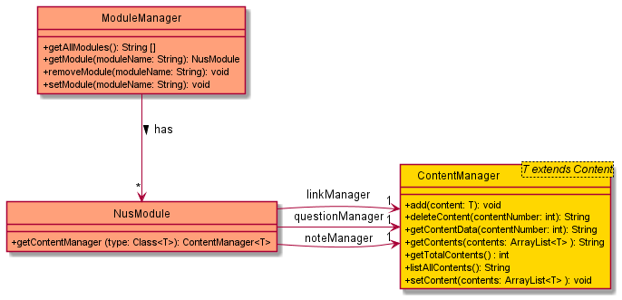
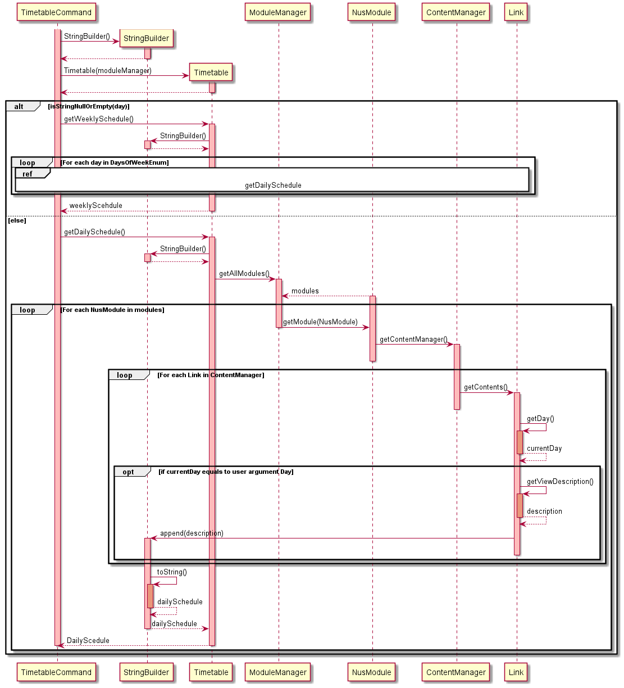
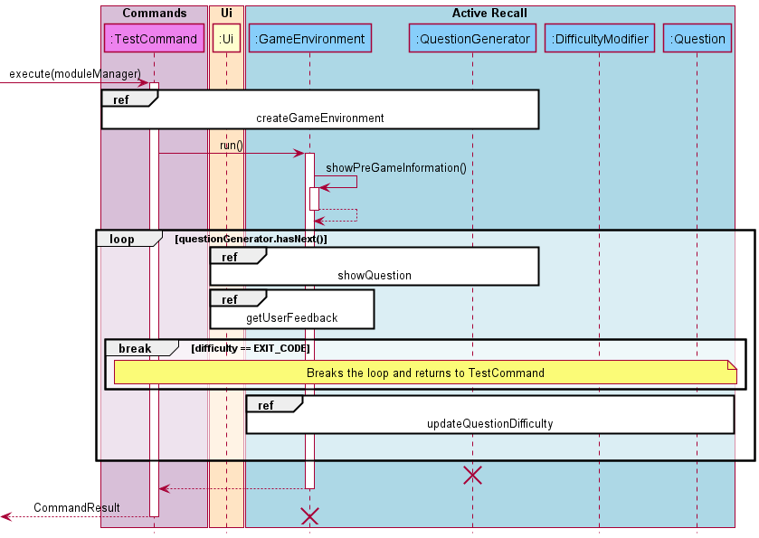

# Developer Guide

## Table of Content

- [1. Introduction](#1-introduction)
    * [1.1 Purpose](#11-purpose)
    * [1.2 Using this Guide](#12-using-this-guide)
- [2. Setting up](#2-setting-up)
    * [2.1 Setting up the project in your computer](#21-setting-up-the-project-in-your-computer)
        + [2.1.1 Prerequisite](#211-prerequisite)
        + [2.1.2 Getting the project files](#212-getting-the-project-files)
        + [2.1.3 Setting up on IntelliJ IDEA](#213-setting-up-on-intellij-idea)
        + [2.1.4 Configuring the Coding Style](#214-configuring-the-coding-style)
- [3. Design](#3-design)
  * [3.1 Architecture](#31-architecture)
  * [3.2 UI](#32-ui-component)
  * [3.3 Parser](#33-parser-component)
  * [3.4 Command](#34-command-component)
  * [3.5 Module](#35-module-component)
  * [3.6 Content](#36-content-component)
  * [3.7 Active Recall](#37-active-recall-component)
  * [3.8 Storage](#38-storage-component)
- [4. Implementation](#4-implementation)
  * [4.1 Timetable](#41-timetable)
  * [4.2 Active Recall](#42-active-recall-implementation)
  * [4.3 Workspace]()
  * [4.4 Adding and Deleting Content]()
  * [4.5 Storage]()
- [5. Documentation, Logging, Testing and DevOps]()
- [Appendix A: Product Scope]()
- [Appendix B: User Stories ]()
- [Appendix C: Non Functional Requirements]()
- [Appendix D: Glossary]()
- [Appendix E: Instructions for Manual Testing]()

## 1. Introduction

**Welcome to TermiNUS!**

**TermiNUS** is a CLI (command line interface) program for NUS Students who wish to organize their
NUS academic materials through a CLI. The product aims to aid student in organizing their academic
schedule and enhancing their learning experiences.

**TermiNUS** is written in **Java 11** and uses the Object-Oriented Programming (OOP) paradigm which
provides us with means to structure a software program into organized and reusable pieces of codes,
making it more efficient for future improvements and revisions.

### 1.1 Purpose

This developer guide is for any developers who wish to contribute to **TermiNUS**. It contains the
overall architecture design of **TermiNUS** and it displays our main features implementation details
with the rationale and consideration for each. As of now, the guide is written for the current
release version of `TermiNUS of v1.0`.

### 1.2 Using this Guide

Insert legends / special icons used here to aid in the guide later.

## 2. Setting up

### 2.1 Setting up the project in your computer

#### 2.1.1 Prerequisite

Before setting up the project, please do ensure you have the following items installed.

- [JDK 11](https://docs.aws.amazon.com/corretto/latest/corretto-11-ug/downloads-list.html)
- [IntelliJ IDEA](https://www.jetbrains.com/idea/download/)

`Java Development Kit ver 11 (JDK 11)` is the **environment / programming language** in which
TermiNUS is written with and `IntelliJ IDEA` will be the **integrated development environment (
IDE)** platform for us to write the programming codes on.

#### 2.1.2 Getting the project files

Go to [link](https://github.com/AY2122S1-CS2113T-T10-2/tp) and retrieve the `TermiNUS project file`.
You can do so by **forking** the project and **cloning** a copy into your computer.

To learn more about github fork-clone feature please follow the guide
on [link](https://docs.github.com/en/get-started/quickstart/fork-a-repo).

#### 2.1.3 Setting up on IntelliJ IDEA

1. Open the application `IntelliJ IDEA`.
2. Inside `IntelliJ IDEA` navigate to `open project` button
    1. On the top left of the app, `File`&rarr;`Open...`
3. Locate and select the folder containing the files for **Terminus** that you have downloaded
   earlier on.
4. Change the **Project SDK** that IntelliJ IDEA will be using.
    1. On the top left of the app, `File`&rarr;`Project Structure...`
    2. Under **Project SDK:** section, find and select JDK version 11.
       Eg: `Amazon Corretto version 11.0.12`.
    3. Under **Project language level:**, select `SDK default`.
5. Verifying the setup
    1. After performing the steps above, locate the file `src/main/java/terminus/Terminus.java`,
       right-click and select `Run 'Terminus.main()'`.
    2. If everything is correctly set up, you should see the following terminal.
   
   ```
   Welcome to TermiNUS!
   
   Type any of the following to get started:
   > exit
   > help
   > note
   > schedule
   
   [] >>>
   ```

#### 2.1.4 Configuring the Coding Style

Import the coding style xml file into your IntelliJ IDEA.

1. Go to IntelliJ IDEA settings page.
    1. Located at the **top-right** of the app, click on the gear icon and select `Settings...`.
2. Under the settings page, locate the `Code Style` tab.
    1. `Editor`&rarr;`Code Style`
3. Once you are at the `Code Style` tab, you will need to import the file `CS2113TStyle.xml`.
    1. At the `Scheme` section, select the gear icon and select `Import Scheme`
       &rarr;`IntelliJ IDEA code style XML`.
    2. Locate and select the `CS2113TStyle.xml` file which is included in the TermiNUS project.
    3. Once done, select `Apply` then `OK`.
4. Now your IntelliJ IDEA should follow our Coding Style.

> :bulb: IntelliJ IDEA have certain shortcut key to aid in auto-formatting of code.
> Once you are done with a piece of code, highlight the section you have just written and press the
> key `CTRL + SHIFT + L`.

## 3. Design

### 3.1 Architecture

### 3.2 UI Component

### 3.3 Parser Component

### 3.4 Command Component

### 3.5 Module Component



The Module Components consists of the `ModuleManager` which contains a collection of `NusModule` and
maps a module name to a specific `NusModule`.
The `NusModule` consist of `ContentManager` which help to manage `Link` and `Note`. 
The `ContentManager` accepts a `Content` type generic which is from the Content Component

The `ModuleManager`
- add, delete or retrieve a specific `NusModule`
- list all module names
- grants access to the different types of content stored by `NusModule`

### 3.6 Content Component


The Content Component consist of objects such as `Link`, `Questions` and `Note`
which inherit from the abstract `Content` class. The `ContentManager` allows a generic 
`<T extends Content>` which must belong to the `Content` type or its children. The 
`ContentManager` manages an `ArrayList` of Content type and provide the following functionality:


- adding of any Content type
- removing any Content
- accessing the Content and the inner data attribute
- getting the total number of content
- listing all contents
- accessing the arraylist of contents

### 3.7 Active Recall Component


The Active Recall Component consists of the `GameEnvironment` as the centre of the design.
The `GameEnvironment` consists of a `QuestionGenerator` which will only exist if there is a 
`GameEnvironment`, and a `Ui` instance to handle user input and printing of information. The 
decision to re-use the `Ui` is to allow easier upgrades to the `Ui` if there is a need in the 
future.
The `QuestionGenerator` takes in a list of `Question` and a maximum question count to randomly
generate questions based on `Random`. If `Random` is not provided, a new `Random` with a random seed
will be created to generate the `Question` order.  
The `DifficultyModifier` is a utility class used to calculate and tweak the weights of `Question`
after the user has provided feedback on the difficulty of the question. It uses a 
[logistic curve](https://en.wikipedia.org/wiki/Logistic_function) to calculate the change in weight.

For further details on the implementation, head to 
[4.2 Active Recall Implementation](#42-active-recall-implementation).

### 3.8 Storage Component


The Module Storage handles any file I/O operations of TermiNUS.

The `ModuleStorage` component:

- can create folder for each module provided by the user.
- can save modules, schedules and links data in a `.json` file.
- can save notes into multiple `.txt` files.

`TermiNUS` saved these data as either a `.json` or `.txt` file so users will be able to edit saved
data easily with any available text editor.


## 4. Implementation

### 4.1 Timetable

The `timetable` feature is one of TermiNUS' features which can be accessed from the main workspace.

The `timetable` feature has 2 variations:
- **Daily** Timetable
- **Weekly** timetable.

The following sequence diagram shows how the timetable operation works:


The **Daily** and **Weekly** `timetable` feature differs by a user argument which is parsed as the `day`.

The **Daily** `timetable` feature works by iterating through a collection of `NusModule` which are stored inside a `ModuleManager`.
Within the `NusModule`, the `ContentManager`, which stores all the `Link` is accessed.
All the `Link` inside `ContentManager` is iterated through to acquire all the schedule which has the same attribute `day` as the user argument.

The **Weekly** `timetable` feature is an extension of the **Daily** `timetable` feature.
It is implemented by iterating through a `DaysOfWeekEnum` and acquires the **daily** `timetable` for each day in the week.


### 4.2 Active Recall Implementation


To view the high-level diagram, head to 
[3.7 Active Recall Component](#37-active-recall-component).

When the user executes the `TestCommand`, the `GameEnvironment` will be created with the static 
method `GameEnvironment.createNewEnvironment()`, where it will handle the creation of
`QuestionGenerator` as well. 

The `QuestionGenerator` creates a `NavigableMap<Double, Question>` to store all the questions, where
the `Double` is the `question.getWeight() + total`, where total is the current sum of all the 
weights currently in the bank. The rationale for the `NavigableMap` and key value will be explained 
at `promptQuestion()` below.

The newly created `GameEnvironment` will be returned to `TestCommand` where it would call the `run` 
method within the object.

The `run()` method consists of 4 main steps (with step 2 to 4 repeating for every question):
1. `showPreGameInformation()`
2. `promptQuestion()`
3. `getUserFeedback()`
4. `updateQuestionDifficulty(question, difficulty)`

The `showPreGameInformation()` method will print the information once on the current Active Recall 
session, such as the actual question pool size, and may include more information and statistics in 
the future.

Next, the `run()` method will start a loop and check if there are questions in the local 
`questionGenerator` to ensure that the session can continue. After which, the `promptQuestion()` is 
called, where the next question is pulled from `questionGenerator.next()` and displayed to the user.

Within the `next()` method in the `QuestionGenerator`, it will find a random `double` number from 
`0` to `total`, and look up a `Question` that is closest to the value. This was the reason for 
using `NavigableMap` as it provides a method called `.higherEntry(key)`, which guarantees a 
`Question` is returned provided the value never exceeds the total weight of the question pool (which
should never happen as the random number generator can only generate between `0` and `total`).

To prevent the user from viewing the answers before they are ready, we have decided to require the 
user to press Enter to display the answer as a method of confirmation, as it is the most effective 
way to ensure the answer does not get revealed unless the user intents to view it. The answer is 
then displayed when the <kbd>Enter</kbd> key is hit, and the `promptQuestion()` passes the 
`Question` asked back to the `run()` method.

The program now runs `getUserFeedback()` to collect user feedback. This is where we utilized the 
same `Ui` class to handle the input of the user data for consistency and future-proofing, and return
the difficulty back to `run()` after cleaning the input. This is also when the user can decide if 
they wish to quit the session, and if they do, the difficulty value will be set to `EXIT_CODE = -1`.

If the `difficulty` is checked to be the `EXIT_CODE`, the loop will break and return. Otherwise, the
`Question`'s difficulty will now be changed in the `updateQuestionDifficulty(question, difficulty)` 
method, where we use the difference between the extremes and the current difficulty to apply into 
the logistic curve to determine the amount to increase or decrease the weight of the randomness by. 

The parameters of the logistic curve can be viewed here:
https://www.desmos.com/calculator/qefovvnuhx.  
The input `x` value is the difference between the extreme and the current weight (e.g. if the weight 
is `0.5` the extreme is the `MAX_VALUE = 0.9` when the question is deemed hard, then the difference
`x` will be `0.9 - 0.5 = 0.4`). The resultant `y` value is used to add or subtract the existing
weight if the question is deemed hard or easy to increase or decrease the chances of the questions 
appearing respectively (e.g. using the same `x = 0.4` value, the `y` value will be `0.225` and it 
will be added to `0.5` to form the new weight `0.725`).

The rationale behind using the logistic curve is to ensure that as harder questions appear more 
often and easier questions appear less. We also want to ensure once the user finds a hard question 
easy, it should quickly move down a difficulty and vice versa. The application of the logistic curve
also prevents the values from increasing too rapidly, and dominating the question pools. It also 
prevents the case where easy questions disappear entirely from the question pool due to low weights. 
We will continue to seek user feedback and tweak the curve parameters if needed if there are any 
issues.

Once the adjustment of weights of the question is done, the process is repeated if there are 
questions left inside `QuestionGenerator`. Otherwise, the Active Recall session will be terminated, 
and the input will be passed back to the `CommandParser`.

